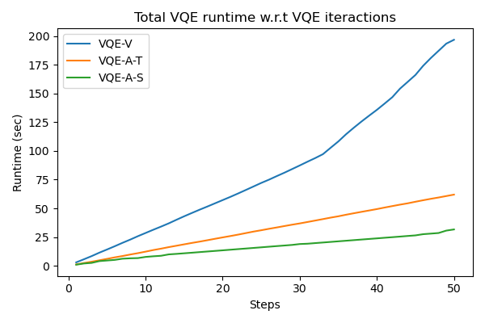

# Orbital-adapted-VQE-demo

### Contributors: [Casey Dowdle](https://github.com/CaseyLeeDowdle), [Weishi Wang](https://github.com/frankwswang)

## Project Introduction

This code repository is a demonstration of applying top-level basis set (orbital) optimization on variational quantum eigensolvers for molecular electronic structure problems.

## Three VQEs, one molecule

We demonstrate three different ways to tackle the problem of finding the minimal energy of molecule BeH2 using a variational quantum eigensolver (VQE) with respect to minimal basis sets using PennyLane. The first notebook, `Main0_VQE_vanillaY.ipynb` is a "vanilla" application of the PennyLane library, just using the default STO-3G basis set parameters, the `default.qubit` simulator, and the `AllSinglesDoubles` circuit template for our VQE ansatz. This Hamilotian has 666 Pauli strings to measure and requires 14 qubits.

For our other two experiments, we use a Julia package called [Quiqbox](https://github.com/frankwswang/Quiqbox.jl) [1] to variationally optimize the basis set parameters of BeH2 in the STO-3G basis for the Hartree-Fock energy. Quiqbox was created by one of our team members, Weishi Wang. The optimized basis set is pre-generated by running `genBasisSet.ipynb` and stored in an HDF5 file `STO-3G_opt.h5G`. We believe that due to the current limitations of NISQ-era devices, it is more optimal to optimize basis set parameters before running a quantum algorithm than optimizing them on the fly. Quiqbox also can create very flexible basis sets such as floating basis sets and mixed-contracted GTO (linear combination of GTOs with mixed centers or orbital angular momentum). Due to the current limitations of PennyLane's basis set options, we could only optimize the parameters with respect to the minimal basis set STO-3G (larger basis sets that PennyLane provides are currently unfeasible for BeH2 to be implemented on actual NISQ devices). In the future, we hope that PennyLane gives users the ability to input custom basis sets into the `Molecule` class and `molecular_hamiltonian` function to further improve the compatibility and extensibility of the VQE framework. For example, for this challenge, it would be interesting to use the STO-6G basis set, which should give lower energies without increasing the number of molecular orbitals.

In the notebook `Main1_VQE_adaptY_taperingY.ipynb` we try to optimize the VQE algorithm under the presumption of being able to run it on an actual NISQ device. We use symmetry-based qubit tapering [2] to reduce the number of required qubits from 14 to 9 based on the Z2 symmetries of our molecular Hamiltonian. We also apply Adapt-VQE [3] to the tapered Hamilotian and tapered single/double excitation gates, reducing the number of double excitation gates from 180 to 32 and reducing the number of single excitation gates from 24 to 6. Thus we have significantly reduced the number of qubits, the depth of the circuit. One problem with realizing this algorithm on real quantum hardware is that the only differentiation method that worked with tapering was `diff_method = backprop`. Both `parameter-shift` differentiation and `finite-diff` gave errors when using the tapered Hamiltonian and excitation gates. We hope PennyLane resolves this issue since qubit tapering is crucial for realizing quantum chemistry algorithms on NISQ devices.

In the notebook `Main2_VQE_adaptY_activeSpaceY.ipynb` we present our computationally fastest VQE algorithm for a classical simulator. We still use the same optimized STO-3G as the input basis set. Additionally, we use a restricted active space of 4 electrons and 6 orbitals since freezing the core orbitals [4] should have a minimal effect on the energy. This brings the number of qubits down to 12. After employing grouping using `qwc`, we reduce the number of measurements down to 99. We again use Adapt-VQE, reducing the number of double excitation gates from 76 to 14 and single excitation gates from 16 to 4. Finally, we use `lightning.qubit` state-vector simulator, the adjoint differentiation method `diff_method='adjoint'`, and a sparse representation of our Hamiltonian. Note that `lightning.qubit` simulator failed in the case of the tapered Hamiltonian.

## Results

Compared to the vanilla VQE, the other two versions of VQE that utilize the optimized STO-3G basis set provided significant improvement of calculating the ground-state energy of colinear BeH2 (with B-H bound length being 1.3264 Å):

| VQE method | Ground-state energy | Relative runtime |
| :---:      | ---:                | ---:             | 
|VQE-V       | -15.5947            | 6.2035           |
|VQE-A-T     | -15.6215            | 1.9555           |
|VQE-A-S     | -15.6213            | 1.0000           |

To be noted, the configuration interaction states used in all three VQE methods are restricted to single and double excitations. The above results can also be obtained from the notebook `compareVQEs.ipynb`.

## Conclusion

Overall, we have demonstrated the practicality of combining basis set optimization with VQE algorithms in the case of BeH2. Since the basis set optimization is done classically and is entirely independent of the downstream VQE algorithm. Technically, our method can be applied to other variants of VQE methods. We would also like to further test out the performance of such classical-quantum hybrid methods on actual NIQS devices in the future.

## References
[1] Wang, W., & Whitfield, J. D. (2022). Basis set generation and optimization in the NISQ era with Quiqbox. jl. arXiv preprint arXiv:2212.04586.

[2] Setia, K., Chen, R., Rice, J. E., Mezzacapo, A., Pistoia, M., & Whitfield, J. D. (2020). Reducing qubit requirements for quantum simulations using molecular point group symmetries. Journal of Chemical Theory and Computation, 16(10), 6091-6097.

[3] Grimsley, H. R., Economou, S. E., Barnes, E., & Mayhall, N. J. (2019). An adaptive variational algorithm for exact molecular simulations on a quantum computer. Nature communications, 10(1), 3007.

[4] Sherrill, C. D., & Schaefer III, H. F. (1999). The configuration interaction method: Advances in highly correlated approaches. In Advances in quantum chemistry (Vol. 34, pp. 143-269). Academic Press.