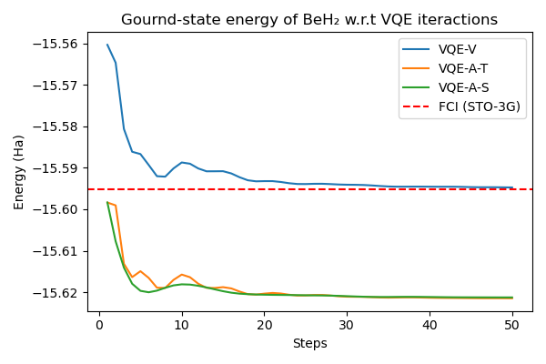

# Orbital-adapted-VQE-demo

### Contributors: [Casey Dowdle](https://github.com/CaseyLeeDowdle), [Weishi Wang](https://github.com/frankwswang)

## Project Introduction

This code repository is a demonstration of applying top-level basis set (orbital) optimization on variational quantum eigensolvers for molecular electronic structure problems.

## Three VQEs, one molecule

We demonstrate three different ways to tackle the problem of finding the ground-state energy of molecule BeH₂ using a variational quantum eigensolver (VQE) with respect to minimal basis sets using PennyLane.

### Vanilla VQE with STO-3G (VQE-V)

The first notebook, `Main0_VQE_vanillaY.ipynb` is a "vanilla" application of the PennyLane library, using the default STO-3G basis set parameters, the `default.qubit` simulator, and the `AllSinglesDoubles` circuit template as the VQE ansatz. The constructed Hamilotian (after Jordan-Wigner transformation) has 666 Pauli strings to measure and requires 14 qubits to build the corresponding quantum circuit.

### Adapt-VQE with optimized STO-3G

For our other two "experiments," we use a Julia package called [Quiqbox](https://github.com/frankwswang/Quiqbox.jl) [1] to variationally optimize the basis set parameters of BeH₂ in the STO-3G basis for the Hartree-Fock energy. Quiqbox was created by one of our team members, Weishi Wang. The optimized basis set is generated by running `genBasisSet.ipynb` and stored in an HDF5 file `lib/STO-3G_opt.h5G`, and then read into the Python environment to update the exponent coefficients and contraction coefficients of the STO-3G basis set stored in the `Molecule` class object, which then is used to construct VQE procedure. We believe that due to the current limitations of NISQ devices, it is better to optimize basis set parameters before running a quantum algorithm than to optimize them on the fly during the VQE interactions.

Quiqbox also can customize flexible basis sets such as floating basis sets and mixed-contracted GTO (linear combination of GTOs with mixed centers or orbital angular momentum). Due to the current limitations of PennyLane's basis set options, we could only optimize the parameters with respect to STO-3G as larger basis set options for BeH₂ provided by PennyLane provides are unfeasible to be implemented on mainstream NISQ devices. In the future, we hope that PennyLane allows users to input custom basis sets into the `Molecule` class or `molecular_hamiltonian` function to further improve the compatibility and extensibility of the VQE framework. For example, it would be of interest to use the STO-6G basis set, which should give lower energies without increasing the number of molecular orbitals.

#### VQE-A-T

In the notebook `Main1_VQE_adaptY_taperingY.ipynb`, we try to perform a VQE simulation under the presumption of the algorithm can be run on an actual NISQ device. We use symmetry-based qubit tapering [2] to reduce the number of required qubits from 14 to 9 based on the Z2 symmetries of the molecular Hamiltonian. We also apply Adapt-VQE [3] to the tapered Hamilotian and tapered single/double excitation gates, reducing the number of double excitation gates from 180 to 32 and the number of single excitation gates from 24 to 6. Thus, we have significantly reduced the number of qubits and the depth of the circuit. One problem with realizing this algorithm on real quantum hardwares is that the only differentiation method that worked with tapering in PennyLane was `diff_method=backprop`. Both `parameter-shift` differentiation and `finite-diff` gave errors when using the tapered Hamiltonian and excitation gates. We hope PennyLane resolves this issue since qubit tapering is crucial for realizing quantum chemistry algorithms on NISQ devices.

#### VQE-A-S

In the notebook `Main2_VQE_adaptY_activeSpaceY.ipynb`, we present our computationally fastest VQE algorithm for a classical simulator. We still use the same optimized STO-3G as the input basis set. Additionally, we use a restricted active space of 4 electrons and 6 orbitals since freezing the core orbitals [4] should have a minimal effect on the energy. This brings the number of qubits down to 12. After employing grouping using `qwc`, we reduce the number of measurements down to 99. We again use Adapt-VQE, reducing the number of double excitation gates from 76 to 14 and single excitation gates from 16 to 4. Finally, we use `lightning.qubit` state-vector simulator, the adjoint differentiation method `diff_method='adjoint'`, and a sparse representation of our Hamiltonian to improve the simulation efficiency as much as possible. Note that `lightning.qubit` simulator failed in the case of the tapered Hamiltonian.

## Results

In the case of Be-H bound length at [1.3264 Å](https://cccbdb.nist.gov/exp2x.asp?casno=7787522&charge=0) for colinear BeH₂, the theoretical converged result of vanilla VQE can already achieve close performance compared to the ground-state energy calculated by the full configuration interaction (FCI) method with unoptimized STO-3G with a relative error around 0.0032%. Furthermore, the other two versions of VQE that utilize the optimized STO-3G basis set provide even more significant improvement.

| VQE method   | Ground-state energy | Relative runtime |
| :---:        | ---:                | ---:             |
| FCI (STO-3G) | -15.5952 Ha         |  --              |
| VQE-V        | -15.5947 Ha         | 14.30 ± 1.26     |
| VQE-A-T      | -15.6215 Ha         |  6.90 ± 1.01     |
| VQE-A-S      | -15.6213 Ha         |  1.00 ± 0.40     |

It should be noted that the spin-orbital configurations (in addition to the restricted Hartree-Fock state as the reference configuration) used to build the quantum circuits for all three VQE methods are restricted to single and double excitations. Also, the fermionic encoding for all three VQEs is restricted to the Jordan-Wigner transformation. The above results can also be obtained from the notebook `compareVQEs.ipynb`.

## Conclusion

Overall, we have demonstrated the practicality of combining basis set optimization with VQE algorithms in the case of BeH₂. Since the basis set optimization is done classically and is agnostic to the downstream VQE algorithm. Technically, our method can be applied to other variants of VQE methods. We would also like to test further the performance of such a hybrid classical-quantum approach with more VQE algorithms on actual NISQ devices in the future.

## Software environment

* Python (>=3.9.13)

* Jupyter Notebook (>=6.4.12)

* PennyLane (>=0.28.0)

* JuliaCall (>=0.9.11)

* Matplotlib (>=3.5.2)

* h5py (>=3.7.0)

## References

[1] Wang, W., & Whitfield, J. D. (2022). Basis set generation and optimization in the NISQ era with Quiqbox. jl. arXiv preprint arXiv:2212.04586.

[2] Setia, K., Chen, R., Rice, J. E., Mezzacapo, A., Pistoia, M., & Whitfield, J. D. (2020). Reducing qubit requirements for quantum simulations using molecular point group symmetries. Journal of Chemical Theory and Computation, 16(10), 6091-6097.

[3] Grimsley, H. R., Economou, S. E., Barnes, E., & Mayhall, N. J. (2019). An adaptive variational algorithm for exact molecular simulations on a quantum computer. Nature communications, 10(1), 3007.

[4] Sherrill, C. D., & Schaefer III, H. F. (1999). The configuration interaction method: Advances in highly correlated approaches. In Advances in quantum chemistry (Vol. 34, pp. 143-269). Academic Press.
